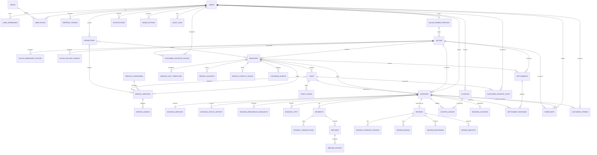

# Salonjaa — Technical Requirements Document

## 1. Project Overview

Salonjaa is a multi-city salon discovery, appointment booking, and salon-management platform. It records customer-created and salon-created walk-in bookings, supports multi-branch salons, and provides platform governance through Admin.

Actors: **Customer** (profile, addresses, booking, payment, review); **Salon Owner** (owns salons and manages branches, staff, services, bookings, and walk-ins); **Admin** (platform governance, salon approval, refunds, moderation, audit access). Staff are managed salon records and have no MVP login or dashboard.

MVP includes email-OTP authentication, salon approval, branch/staff/service management, availability and capacity validation, multi-service bookings, approval/reschedule/cancellation/expiry workflows, online and pay-at-salon payments, manual settlements, coupons/promotions, reviews, notifications, reports/analytics, and audit logging. Excluded features remain excluded as stated in the BRD (wallet, loyalty, referral, subscriptions, automated settlements, staff portal, and similar future features).

## 2. Technical Stack

| Area | Requirement |
|---|---|
| Backend | Node.js, Express.js, TypeScript |
| Database | PostgreSQL with Drizzle ORM and migrations |
| Infrastructure | Redis and BullMQ |
| Authentication | Email OTP, JWT access token (15 minutes), JWT refresh token (30 days) |

Use PostgreSQL transactions for every booking state/capacity mutation. Redis is never the booking source of truth; `booking.scheduled_start` and `booking.scheduled_end` are.

## 3. Module Breakdown

| Module | Purpose | Responsibilities | Dependencies |
|---|---|---|---|
| Auth | Authenticate users | email OTP issue/verify, token issue/refresh/logout, sessions | User, Notification, Redis, Audit |
| User | Customer identity | profile, role lookup, booking history, favourites | Auth, Address, Booking, Salon, Staff |
| Address | Customer addresses | owned CRUD and default address handling | User |
| Salon | Salon organisation | owner profile, onboarding, lifecycle/verification, ownership audit | User, Admin, Branch |
| Branch | Independently operated location | address, hours, chairs, holidays, slot templates, capacity override | Salon, Availability |
| Staff | Branch personnel | staff lifecycle, service assignment, leave, availability input | Branch, Service, Booking |
| Service Category | Service classification | platform category lifecycle | Service |
| Service | Branch catalogue | service CRUD, images, price/duration, staff assignment | Branch, Category, Staff, Booking |
| Booking | Appointment lifecycle | create, overlap/capacity validation, approval, cancellation, reschedule, walk-in, status history/check-in OTP | Availability, Payment, Coupon, Notification, Audit |
| Payment | Payment records | provider orders/verification, pay-at-salon, refunds, coupon validation, settlements | Booking, Coupon, Admin, Audit |
| Coupon | Discount lifecycle | owner/admin coupons, validation, immutable use snapshots | Booking, Payment |
| Review | Completed-booking feedback | review/rating/images/reply/report/moderation data | Booking, User, Salon, Service, Staff, Admin |
| Notification | Event delivery | template rendering, delivery records, channel providers | BullMQ, Auth, Booking, Payment |
| Admin | Platform operations | approvals, suspensions, refunds, moderation, complaints, reports, analytics, audit search | all modules |

## 4. Database Design

Conventions: all primary IDs are UUIDs; monetary values are `numeric(12,2)`; timestamps are `timestamptz`; operational entities have `created_at` and `updated_at` unless stated; `deleted_at` is the soft-delete marker. FK deletes must preserve historical booking/payment/audit data (`RESTRICT` or nullable snapshot-preserving reference).

### Identity and organisation

| Table | Purpose / columns | Relationships, constraints, indexes, delete and audit rules |
|---|---|---|
| `users` | `id`, `email`, `email_verified`, `full_name`, `phone`, `gender`, `dob`, `profile_image`, `status`, timestamps, `deleted_at` | `email` unique (case-normalized); indexes `status`, `deleted_at`; parent of profiles, addresses, roles, bookings. Soft delete/deactivation never deletes history. |
| `roles` | `id`, `name`, timestamps | Seed `CUSTOMER`, `SALON_OWNER`, `ADMIN`; unique `name`. |
| `user_roles` | `user_id`, `role_id`, `created_at` | composite PK/unique `(user_id,role_id)`; FKs to users/roles; index `role_id`. Roles are authoritative, never a `users.role` field. |
| `user_addresses` | `id`, `user_id`, `label`, address lines, city/state/country/postal code, latitude/longitude, `is_default`, timestamps, `deleted_at` | FK user; index `(user_id,deleted_at)`; partial unique one default address per user; owned access only; soft delete. |
| `refresh_tokens` | `id`, `user_id`, `token_hash`, `expires_at`, `revoked_at`, `created_at` | FK user; unique token hash; indexes `(user_id,revoked_at)`, `expires_at`; one row/session, allowing multiple active sessions. Never store raw JWT. |
| `salon_owner_profiles` | `id`, `user_id`, `business_name`, `gst_number`, `pan_number`, `kyc_status`, `status`, timestamps, `deleted_at` | FK user; unique active profile per user; unique non-null GST/PAN as applicable; index KYC/status. Owner profile owns many salons. |
| `salons` | `id`, `owner_profile_id`, `name`, `description`, `logo`, `cover_image`, `status`, `verification_status`, `verification_reason`, timestamps, `deleted_at` | FK owner profile; indexes `(status,verification_status,deleted_at)`, `owner_profile_id`; only `ACTIVE` + `VERIFIED` are public/bookable. Soft delete hides from normal operations. |
| `salon_ownership_history` | `id`, `salon_id`, `from_owner_profile_id`, `to_owner_profile_id`, `changed_by_user_id`, `reason`, `created_at` | FKs to salon/profiles/users; indexes `salon_id`, `created_at`; append-only audit, no delete. |
| `salon_gallery_images` | `id`, `salon_id`, `image_url`, `display_order`, `created_at`, `deleted_at` | FK salon; unique `(salon_id,display_order)` among active images; soft delete. |
| `customer_favorite_salons` | `customer_id`, `salon_id`, `created_at` | composite PK; FKs users/salons; no soft delete required—row removal is unfavourite. |
| `customer_favorite_staff` | `customer_id`, `staff_id`, `created_at` | composite PK; FKs users/staff. |

### Branch, staff, and catalogue

| Table | Purpose / columns | Relationships, constraints, indexes, delete and audit rules |
|---|---|---|
| `branches` | `id`, `salon_id`, name/contact, address fields, geo coordinates, `total_chairs`, `opening_time`, `closing_time`, `status`, timestamps, `deleted_at` | FK salon; `total_chairs > 0`, opening < closing; index `(salon_id,status,deleted_at)`; historical booking references retained; soft delete. |
| `branch_slot_templates` | `id`, `branch_id`, `name`, `start_time`, `end_time`, `slot_duration_minutes`, `active`, timestamps | FK branch; start < end, duration > 0; index `(branch_id,active)`; templates generate UI slots dynamically and are not booking truth. |
| `branch_holidays` | `id`, `branch_id`, `holiday_date`, `reason`, `created_by`, `created_at` | FK branch/user; unique `(branch_id,holiday_date)`; index `(branch_id,holiday_date)`; retained for history. |
| `branch_capacity_rules` | `id`, `branch_id`, `max_capacity_override` nullable, timestamps | FK branch; one active configuration per branch (unique `branch_id`); non-null override > 0. |
| `calendar_events` | `id`, `branch_id`, `event_type`, `reference_id`, `title`, `start_datetime`, `end_datetime`, `created_at` | FK branch; index `(branch_id,start_datetime,end_datetime)`; derived unified calendar feed; timestamps valid (`start < end`). |
| `staff` | `id`, `branch_id`, full/contact fields, profile image, gender, joining date, experience, bio, `staff_type`, consultation fee, salary, `status`, timestamps, `deleted_at` | FK branch; index `(branch_id,status,deleted_at)`; soft delete/disable preserves historical references. |
| `staff_leaves` | `id`, `staff_id`, `start_datetime`, `end_datetime`, reason, `status`, `created_at` | FK staff; `start < end`; index `(staff_id,status,start_datetime,end_datetime)`; cancellation changes status, never removes record. |
| `service_categories` | `id`, name, slug, icon, `status`, timestamps, `deleted_at` | unique active `slug`; index status; soft delete. |
| `branch_services` | `id`, `branch_id`, `category_id`, name, description, `duration_minutes`, `base_price`, image URL, `status`, timestamps, `deleted_at` | FKs branch/category; duration > 0, price > 0; indexes `(branch_id,status,deleted_at)`, `(category_id,status)`; soft delete/disable; booking snapshots preserve historical data. |
| `service_images` | `id`, `service_id`, `image_url`, `display_order`, `created_at`, `deleted_at` | FK service; unique active `(service_id,display_order)`; soft delete. |
| `staff_services` | `staff_id`, `service_id`, `created_at` | composite PK; FKs; index `service_id`; assignment affects future availability only. |

### Booking and availability

| Table | Purpose / columns | Relationships, constraints, indexes, delete and audit rules |
|---|---|---|
| `bookings` | `id`, unique `booking_number`, `customer_id` nullable for unregistered walk-in, `salon_id`, `branch_id`, `booking_type`, `booking_status`, nullable `selected_staff_id`, `scheduled_start`, `scheduled_end`, `total_duration_minutes`, subtotal/discount/tax/total amounts, notes/rejection/cancellation/reschedule reasons, approval/completion/cancellation/expiry timestamps, timestamps | FKs user/salon/branch/staff; start < end, duration > 0, amounts >= 0; indexes `(branch_id,scheduled_start,scheduled_end,booking_status)`, `(customer_id,created_at)`, `(salon_id,booking_status)`, `(selected_staff_id,scheduled_start,scheduled_end)`; never soft-delete or physically delete. |
| `booking_services` | `id`, `booking_id`, `service_id`, name/duration/price snapshots, quantity, total amount | FK booking; service reference restricts deletion; quantity > 0, snapshots valid; index booking ID; immutable after booking creation. |
| `booking_status_history` | `id`, `booking_id`, old/new status, `changed_by_user_id` nullable, notes, `created_at` | FK booking/user; index `(booking_id,created_at)`; append-only immutable. |
| `booking_reschedule_requests` | `id`, `booking_id`, `requested_by`, old/new start/end, reason, status, `responded_at`, `created_at` | FK booking; new range valid; index `(booking_id,status,created_at)`; append-only lifecycle record. |
| `booking_otps` | `id`, `booking_id`, `otp_hash`, generated/expiry/verified timestamps, attempts, `status` | FK booking; one active OTP per booking (partial unique); `expires_at > generated_at`; index expiry/status; no plaintext OTP. |

### Payment, coupon, and settlement

| Table | Purpose / columns | Relationships, constraints, indexes, delete and audit rules |
|---|---|---|
| `payments` | `id`, `booking_id`, `customer_id` nullable, method/provider, provider payment ID, amount/currency/status, `paid_at`, timestamps | FKs booking/user; amount > 0, currency `INR`; unique non-null provider payment ID; indexes `(booking_id,status)`, `(customer_id,created_at)`; immutable financial history. |
| `payment_transactions` | `id`, `payment_id`, provider, transaction/order IDs, signature, raw response JSONB, status, `created_at` | FK payment; unique provider transaction ID where present; index payment ID; append-only. |
| `refunds` | `id`, booking/payment/customer IDs, amount/reason/status, `approved_by`, `processed_at`, `created_at` | FKs; amount > 0; indexes `(payment_id,status)`, `(customer_id,created_at)`; retain forever. |
| `refund_history` | `id`, `refund_id`, old/new status, changed_by, notes, `created_at` | FK refund/user; append-only. |
| `coupons` | `id`, `created_by_user_id`, unique code, type/value/minimum/max discount, usage limit/used count, starts/expires, active, timestamps, `deleted_at` | FK creator; date range valid, values >= 0, usage limit >= 0; indexes `(coupon_code)`, `(active,starts_at,expires_at)`; soft delete/inactivate only. |
| `coupon_usages` | `id`, `coupon_id`, `booking_id`, `customer_id`, discount amount, `used_at` | FKs; unique `(coupon_id,booking_id)`; indexes coupon/customer; immutable consumption record. |
| `booking_coupons` | `id`, `booking_id`, code/type/discount snapshots, applied amount | FK booking; unique booking ID (one applied coupon); immutable snapshot. |
| `settlements` | `id`, salon ID, nullable branch ID, date range, gross/commission/refund/adjustment/net amounts, status, settled time, created time | FKs; range valid; indexes `(salon_id,status,created_at)`, branch; manual MVP records, never delete. |
| `settlement_bookings` | `settlement_id`, `booking_id` | composite PK, FKs; booking can be included only once (unique booking ID). |

### Reviews, notification, admin, and marketing

| Table | Purpose / columns | Relationships, constraints, indexes, delete and audit rules |
|---|---|---|
| `reviews` | `id`, booking/customer/salon/branch IDs, nullable staff ID, overall rating, review text, `is_edited`, timestamps, `deleted_at` | unique `booking_id` (one review per booking); ratings 1–5; index salon/staff/customer; only completed booking owner may insert; moderation uses soft delete/hide. |
| `review_category_ratings` | `id`, `review_id`, category, rating | FK review; unique `(review_id,category)`; rating 1–5. |
| `review_images` | `id`, `review_id`, URL, uploaded time, `deleted_at` | FK review; soft delete/moderation. |
| `review_responses` | `id`, `review_id`, `responded_by`, text, `created_at` | FKs; index review; retain response history. |
| `review_reports` | `id`, `review_id`, reporter, reason, status, reviewer, created time | FKs; unique `(review_id,reported_by)`; index status; retained. |
| `notifications` | `id`, user ID, type, event type, subject/message, status, sent/read times, created time | FK user; index `(user_id,status,created_at)`, `(status,created_at)`; delivery history retained. |
| `notification_templates` | `id`, name, event type, subject/body templates, active, timestamps | unique name; index active/event type; version/change audit required. |
| `email_otps` | `id`, email, `otp_hash`, purpose, expiry, attempts, verified time, status, created time | index `(email,purpose,status,expires_at)`; one active OTP per email/purpose (partial unique); never plaintext. |
| `promotions` | `id`, creator, title/description/banner, start/end, active, created time, `deleted_at` | FK user; valid date range; index active/date range; soft delete/inactivate. |
| `promotion_branches` / `promotion_services` | promotion ID + branch/service ID | composite PK/FKs; target mappings, no duplicate mapping. |
| `complaints` | `id`, customer ID, nullable booking/salon IDs, type, description, status, resolver/time, created time | FKs; indexes status/customer; retained. |
| `customer_strikes` | `id`, customer ID, nullable booking ID, type, notes, removed fields, created time | FKs; index `(customer_id,removed_at)`; append-only; removal is metadata, not deletion. |
| `admin_actions` | `id`, admin user ID, entity type/ID, action, notes, created time | FK user; index `(entity_type,entity_id,created_at)`; immutable. |
| `audit_logs` | `id`, nullable actor ID, entity type/ID, action, old/new JSONB, IP, user agent, created time | FK user; index `(entity_type,entity_id,created_at)`, actor; immutable, no application update/delete. |

## 5. Entity Relationships



## 6. Enums

Implement PostgreSQL/TypeScript enums: `UserStatus(ACTIVE,INACTIVE,SUSPENDED)`, `UserGender(MALE,FEMALE,OTHER,PREFER_NOT_TO_SAY)`, `RoleType(CUSTOMER,SALON_OWNER,ADMIN)`, `KYCStatus(PENDING,APPROVED,REJECTED)`, `SalonStatus(ACTIVE,INACTIVE,SUSPENDED)`, `VerificationStatus(PENDING,VERIFIED,REJECTED)`, `BranchStatus(ACTIVE,INACTIVE,CLOSED)`, `StaffType(NORMAL,STAR)`, `StaffStatus(ACTIVE,INACTIVE)`, `LeaveStatus(APPROVED,CANCELLED)`, `ServiceStatus(ACTIVE,INACTIVE)`, `BookingType(ONLINE,WALK_IN)`, `BookingStatus(PENDING,APPROVED,REJECTED,EXPIRED,CANCELLED,COMPLETED,REFUND_PENDING,REFUNDED,NO_SHOW)`, `RescheduleRequestStatus(PENDING,ACCEPTED,REJECTED)`, `RequestedBy(CUSTOMER,SALON)`, `StrikeType(FAKE_BOOKING,NO_SHOW,ABUSIVE_CANCELLATION)`, `PaymentMethod(ONLINE,PAY_AT_SALON)`, `PaymentProvider(NONE,RAZORPAY,CASHFREE)`, `PaymentStatus(PENDING,SUCCESS,FAILED,REFUNDED,PARTIALLY_REFUNDED)`, `RefundStatus(PENDING,APPROVED,PROCESSING,COMPLETED,REJECTED)`, `CouponType(FIXED,PERCENTAGE)`, `SettlementStatus(PENDING,PROCESSING,COMPLETED)`, `NotificationType(EMAIL,SMS,WHATSAPP,IN_APP)`, `NotificationStatus(PENDING,SENT,FAILED,READ)`, `OTPPurpose(LOGIN,REGISTER,VERIFY_EMAIL,BOOKING_CHECKIN)`, `OTPStatus(ACTIVE,VERIFIED,EXPIRED)`, `ReviewReportStatus(PENDING,APPROVED,REJECTED)`, `ComplaintType(BOOKING,PAYMENT,SALON,STAFF,REFUND,OTHER)`, and `ComplaintStatus(OPEN,IN_PROGRESS,RESOLVED,REJECTED)`, `AdminActionType(APPROVE,REJECT,SUSPEND,REMOVE_STRIKE,REFUND,EDIT)`.

`NO_SHOW` is included because the finalized BRD requires it, although it is absent from the supplied enum file.

## 7. API Mapping

Base prefix: `/api/v1`. Controller → service → repository follows the module name, e.g. `AuthController → AuthService → AuthRepository`.

| Endpoint(s) | Module | Controller / service / repository | Tables | Authorization |
|---|---|---|---|---|
| `POST /auth/send-otp`, `/verify-otp`, `/refresh-token`, `/logout` | Auth | Auth | email_otps, users, roles, user_roles, refresh_tokens, notifications, audit_logs | Public except logout authenticated |
| `GET/PATCH /users/me`, `GET /users/me/bookings` | User | User | users, user_roles, bookings, booking_services | Authenticated owner |
| `POST/GET /users/me/addresses`, `PATCH/DELETE /users/me/addresses/:id` | Address | Address | user_addresses | Authenticated owner |
| `POST/GET /salons`, `GET/PATCH/DELETE /salons/:salonId` | Salon | Salon | salon_owner_profiles, salons, ownership_history, audit_logs | Salon owner; must own salon |
| `POST /branches`, `GET /branches`, `GET /branches/:id`, `PATCH /branches/:id`, holiday and capacity-rule routes | Branch | Branch | branches, holidays, capacity_rules, salon_owner_profiles | Salon owner; must own parent salon |
| `POST /staff`, `GET /staff`, `GET /staff/:id`, `PATCH /staff/:id`, `DELETE /staff/:id`, leave routes | Staff | Staff | staff, staff_leaves, staff_services, branches | Salon owner; branch ownership |
| `POST /services`, `GET /services`, `GET /services/:id`, `PATCH /services/:id`, `DELETE /services/:id`, staff assignment routes | Service | Service | branch_services, service_categories, staff_services | Salon owner; branch ownership |
| `GET /availability/slots`, `GET /availability/staff` | Booking/Availability | Availability | branches, templates, holidays, staff, leaves, services, bookings | Public discovery endpoint; only bookable active/verified data |
| booking CRUD/history/cancel/reschedule routes | Booking | Booking | bookings, booking_services, status_history, reschedule_requests, strikes, booking_otps, audit_logs | Customer owner; salon approval actions are owning Salon Owner; booking detail also Admin |
| `GET/POST /salon-bookings`, approve/reject/propose-reschedule/walk-in | Booking | SalonBooking | bookings, booking_services, history, reschedule, users, payments | Salon owner; only owned branch/salon |
| `POST /salon-bookings/:id/block-slot` | Booking | — | — | Explicitly marked **not MVP** in API Inventory; do not implement. |
| payment create/verify/detail/history/refund/settlement/coupon validate routes | Payment/Coupon | Payment | payments, transactions, refunds, histories, settlements, coupons/usages/snapshots | Customer owner; payment detail Admin/owning Salon Owner; settlements owning Salon Owner |
| review create/upload/edit/detail/list/report/reply routes | Review | Review | reviews, ratings, images, responses, reports, bookings | Customer owner for create/edit/upload; salon owner for owned reply/report; reads public |
| Admin inventory | Admin | Admin | admin_actions, audit_logs and scoped domain tables | No Admin endpoints were supplied; do not expose routes until inventory is finalized. |

## 8. Booking Engine Technical Specification

1. Validate authenticated customer is not restricted unless the applicable advance-payment path is satisfied; validate salon `ACTIVE/VERIFIED`, active branch, active services belonging to that branch, and a non-empty service list.
2. In a single serializable transaction, read service data and calculate `total_duration_minutes = Σ(duration_snapshot × quantity)`, `subtotal = Σ(price_snapshot × quantity)`, discount/tax/total, and `scheduled_end = scheduled_start + duration`. Services execute sequentially; parallel execution is not supported.
3. Validate selected start against active branch template, branch hours, and the complete `[start,end)` range. Reject dates in a branch holiday/emergency closure and ranges outside closing time. Slot IDs are UI helpers: resolve the start time from the template; never persist a slot as the capacity source of truth.
4. Compute effective capacity: `min(branch.total_chairs, active service staff count, capacity override when present)`. Count active staff valid for the requested booking interval; approved leave overlaps remove staff from that count.
5. Lock the branch booking interval query and count capacity-consuming bookings using interval overlap `existing.scheduled_start < new.end AND existing.scheduled_end > new.start`. Pending bookings reserve immediately; approved bookings continue to consume; rejected/expired/cancelled/refunded/completed do not. Reject if the count would exceed effective capacity at any overlapping slot window.
6. If a staff member is selected, require active staff in the branch, assigned to every selected service, not on approved leave, and no conflicting capacity-consuming stylist-specific booking. Reserve selected staff for the full interval on creation/approval. If no staff is selected, validate branch capacity only and reserve no individual staff.
7. Insert booking and immutable service snapshots as `PENDING`, insert status history/audit log, set `expires_at` from the configurable Admin value (default 12 hours), and enqueue expiry/notifications after commit.

Approval: only the owner of the booking’s salon may approve a still-pending, unexpired booking. Re-read capacity and selected stylist availability in the transaction, transition to `APPROVED`, set `approved_at`, generate the booking check-in OTP, write history/audit, and notify. Rejection: only pending booking; reason mandatory; transition to `REJECTED`, write history/audit, and capacity is released by status exclusion.

Expiry: the delayed job locks the booking; only a still-`PENDING` booking whose expiry has passed transitions to `EXPIRED`. It does not create a strike and notifies customer and owner. Cancellation of an upcoming booking transitions to `CANCELLED`, records reason/time/history, releases availability, and records a strike only under the finalized strike rules.

Rescheduling: retain original booking interval while request is pending. Validate the proposed full interval before accepting. Acceptance atomically updates `scheduled_start/end`, creates status/audit history, and leaves original unchanged on rejection. The supplied customer request route targets salon approval; the salon-proposed route requires customer acceptance—route naming/acceptance endpoints are not present in the inventory and must not be invented here.

Walk-in: Salon Owner creates an `ONLINE`-independent `WALK_IN` booking for an existing customer or creates/links a customer record. Apply the exact duration, slot, capacity, and selected-staff validation; include in reporting; commission is not applied and revenue belongs directly to salon. Record pay-at-salon payment separately when collected. No customer-facing approval flow is required by supplied rules.

Edge cases: concurrent booking attempts are protected by transaction isolation/locking and final overlap recheck; end equals another booking’s start is not overlap; service/staff changes never rewrite snapshots; later staff unavailability never auto-cancels existing approved bookings; owner resolves with reassignment (customer approval), reschedule, or refund; appointment check-in OTP is one-time, hashed, time-limited, and audited.

## 9. Redis Design

| Key pattern | Purpose | TTL |
|---|---|---|
| `otp:email:{purpose}:{emailHash}` | OTP request cooldown / active OTP guard | OTP expiry; source record remains PostgreSQL |
| `ratelimit:otp:email:{emailHash}` | Per-email OTP rate limiting | configured window |
| `ratelimit:auth:ip:{ip}` | Auth endpoint rate limit | configured window |
| `ratelimit:api:{ip}:{route}` | Critical endpoint abuse control | configured route window |
| `booking:lock:{branchId}:{startISO}:{endISO}` | short transaction/distributed contention lock | transaction duration only; always release |
| `cache:availability:{branchId}:{date}:{serviceHash}:{staffId}` | computed slot/staff result | short TTL; invalidate on booking/staff/leave/holiday/capacity/service change |
| `cache:salon:{salonId}` / `cache:services:{branchId}` | public read cache | invalidate on writes; bounded TTL |
| `session:revoked:{jti}` (optional) | immediate access-token logout denylist | remaining access-token lifetime |

TTL values not numerically finalized in source material except token life and configurable booking expiry; define them as environment/config values, not product rules.

## 10. BullMQ Jobs

| Job | Trigger / payload | Retry and failure handling |
|---|---|---|
| `notification:send` | domain event; notification ID/template/channel | exponential retries for provider failures; persist each result in notifications; dead-letter after configured attempts |
| `booking:expire` | booking creation; `{bookingId, expiresAt}` delayed job | retry transient DB error; idempotently lock/recheck state/expiry; alert/dead-letter on exhaustion |
| `booking:checkin-otp` | booking approval; `{bookingId}` | generate hashed OTP once/idempotently, send notification; retry delivery separately |
| `promotion:deactivate` | promotion end time; `{promotionId}` | idempotently set inactive; retry DB failures |
| `payment:provider-event` | verified provider webhook/event record | idempotent by provider transaction ID; signature failure is non-retryable/audited |
| `refund:process` | Admin-approved refund; `{refundId}` | retry provider-transient failures; move to failed operational alert while preserving refund history |

## 11. Notification Design

Use a `NotificationProvider` interface with Email as the MVP implementation. Persist a notification before enqueueing delivery; templates are rendered from trusted server-side event data. Send email for OTP, booking creation/approval/rejection/expiry, reschedule request/decision, cancellation, refund status, and promotion events. Keep `SMSProvider` and `WhatsAppProvider` adapters behind the same interface; no SMS/WhatsApp provider is implemented in MVP. Provider payloads must never contain raw secrets or OTP hashes.

## 12. Security Design

Authenticate protected routes with 15-minute signed JWT access tokens. Store 30-day refresh-token hashes in PostgreSQL; rotation/revocation occurs on logout; accept multiple sessions. Derive authorization only from `user_roles`, then apply ownership checks to salon/branch/staff/booking/payment resources. Email and booking OTPs are random, hashed at rest, single-use, expiry-checked, and attempt-limited. Apply Redis rate limits to OTP/auth/critical endpoints and validate all inputs, UUIDs, timestamps, enums, uploads, and ownership server-side. Verify payment webhooks/signatures before mutation. Write immutable audit logs for critical actions with actor, entity, old/new values, IP and user agent; log security events without logging token/OTP/secrets. Use parameterized Drizzle queries, least-privilege database credentials, encrypted configuration/secrets, restrictive upload type/size validation, and consistent safe error responses.

## 13. Backend Folder Structure

```text
src/
  app.ts  server.ts
  config/                 # env validation, database, redis, queue, JWT
  db/
    schema/ migrations/ seed/
  modules/
    auth/ user/ address/ salon/ branch/ staff/ service-category/ service/
    availability/ booking/ payment/ coupon/ review/ notification/ admin/
    <module>.routes.ts <module>.controller.ts <module>.service.ts <module>.repository.ts
    <module>.schema.ts <module>.validator.ts <module>.types.ts
  providers/              # email, OTP, payment provider interfaces/adapters
  queues/                 # queue definitions, producers, workers
  middleware/             # auth, role, ownership, validation, rate-limit, error
  shared/                 # errors, response, logger, constants, pagination, time
  jobs/                   # job processors
  routes/v1.ts
  tests/                  # unit, integration, fixtures
drizzle.config.ts
```

## 14. Development Order

1. Foundation: environment validation, Express middleware, error format, PostgreSQL/Drizzle, migrations, Redis, BullMQ, logging/audit primitives.
2. Identity: enums, users/roles/sessions/addresses, Email OTP providers, JWT/auth middleware.
3. Salon domain: owner profiles, salons, admin approval persistence, branches, holidays, templates, capacity rules.
4. Catalogue/staff: categories, services/images, staff, assignment, leave.
5. Availability: slot generation and time-range/capacity/stylist validation with tests.
6. Booking: snapshots, transactional creation, approval/rejection/cancel/reschedule/expiry/walk-in/check-in OTP.
7. Payment/coupon: provider abstraction, orders/verification/webhook, pay-at-salon records, refund, coupons, manual settlements.
8. Review/notification: reviews/report/replies/media and notification queue/email.
9. Admin/reporting: complaints, strikes, moderation, actions, audit search, reports/analytics.
10. Hardening: authorization matrix tests, concurrency tests, observability, migration/recovery verification.

## 15. Coding Checklist

- [ ] Read and apply the BRD/ERD/API-inventory source documents before modifying behaviour.
- [ ] Add each enum and Drizzle migration with constraints/indexes from this TRD.
- [ ] Use transactions and immutable history/audit rows for state-changing workflows.
- [ ] Enforce role plus resource ownership in services, not only routes.
- [ ] Snapshot booking services and coupons; never recompute historical price/duration.
- [ ] Recheck capacity/stylist availability inside the booking mutation transaction.
- [ ] Never store plaintext OTPs or refresh tokens.
- [ ] Queue post-commit notifications/jobs and make handlers idempotent.
- [ ] Add unit tests for validation/state transitions and integration tests for all listed APIs.
- [ ] Add concurrent booking tests, expiry tests, and payment webhook signature/idempotency tests.
- [ ] Record implementation milestones in `changelog.md`; update `context.md` when a decision is finalized.
